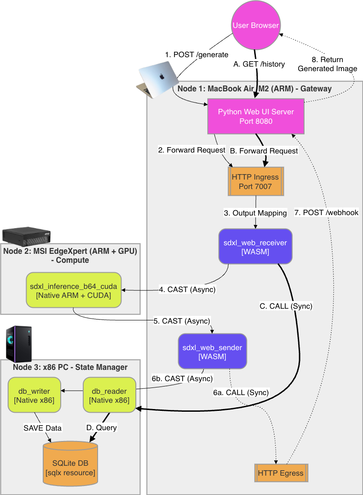

# SDXL WebApp CUDA Example

A distributed edge AI image generation application demonstrating multi-architecture execution across heterogeneous hardware.

## Overview

This example showcases a complete AI image generation pipeline using Edgeless functions deployed across three different nodes with distinct architectures:

- **Gateway Node** (MacBook Air M2 / ARM): Runs WebAssembly functions for request handling
- **Compute Node** (MSI EdgeXpert / ARM + CUDA): Executes AI inference using NVIDIA GPU
- **State Node** (daisone / x86): Manages persistent storage with SQLite

## Architecture



## Key Features Demonstrated

### Multi-Architecture Execution

This example runs Edgeless functions across three different execution environments:

| Function | Type | Architecture | Node |
|----------|------|--------------|------|
| `sdxl_web_receiver` | WASM | ARM (Darwin) | Gateway |
| `sdxl_web_sender` | WASM | ARM (Darwin) | Gateway |
| `sdxl_inference_b64_cuda` | Native | ARM + CUDA | Compute |
| `db_writer` | Native | x86 | State |
| `db_reader` | Native | x86 | State |

### HTTP Ingress & Egress

- **HTTP Ingress** (Port 7007): Receives incoming HTTP requests and routes them to the appropriate Edgeless functions
- **HTTP Egress**: Enables functions to make outbound HTTP calls (webhooks) to return results to the Python web server

### SQLx Resource

A SQLite database (`image_history.db`) stores generation history using the Edgeless SQLx resource, enabling:
- Persistent storage of generated images and prompts
- History retrieval for the web UI

### Asynchronous Processing

The system uses Edgeless's CAST (async) and CALL (sync) primitives:
- CAST for fire-and-forget processing (AI inference, database writes)
- CALL for request-response patterns (webhooks)

## Components

### Python Web UI Server (`web_ui_server.py`)

A standalone Python HTTP server (Port 8080) providing:
- Web interface for image upload and generation
- Bridge between browser and Edgeless cluster
- Webhook endpoint for receiving async results

### Workflow Configuration (`workflow.json`)

Defines the Edgeless cluster topology with:
- Five functions across three nodes
- HTTP ingress/egress resources
- SQLx database resource

## TOML files used
1. MacBook node

    a. `controller.toml`
    ```
    controller_url = "http://127.0.0.1:7001"
    domain_register_url = "http://127.0.0.1:7002"
    persistence_filename = "controller.save"
    ```

    b. `orchestrator.toml`
    ```
    [general]
    domain_register_url = "http://127.0.0.1:7002"
    subscription_refresh_interval_sec = 2
    domain_id = "domain-7000"
    orchestrator_url = "http://127.0.0.1:7000"
    orchestrator_url_announced = "http://127.0.0.1:7000"
    node_register_url = "http://127.0.0.1:7003"

    [baseline]
    orchestration_strategy = "Random"

    [proxy]
    proxy_type = "None"
    proxy_gc_period_seconds = 0
    ```

    c. `node.toml`
    ```
    [general]
    node_id = "bec1d62c-5212-4a27-b4aa-f57ed6a14ea2"
    agent_url = "http://127.0.0.1:7004"
    agent_url_announced = "http://127.0.0.1:7004"
    invocation_url = "http://127.0.0.1:7005"
    invocation_url_announced = "http://127.0.0.1:7005"
    node_register_url = "http://127.0.0.1:7003"
    subscription_refresh_interval_sec = 2

    [telemetry]
    metrics_url = "http://127.0.0.1:7006"
    performance_samples = false

    [wasm_runtime]
    enabled = true

    [container_runtime]
    enabled = false
    guest_api_host_url = "http://127.0.0.1:7100"

    [native_runtime]
    enabled = true

    [resources]
    prepend_hostname = true
    http_ingress_url = "http://127.0.0.1:7007"
    http_ingress_provider = "http-ingress-1"
    http_egress_provider = "http-egress-1"
    http_poster_provider = ""
    file_log_provider = ""
    redis_provider = ""
    dda_provider = ""
    kafka_egress_provider = ""
    sqlx_provider = ""

    [resources.file_pusher_provider]
    directory = ""
    provider = ""

    [resources.ollama_provider]
    host = "localhost"
    port = 11434
    messages_number_limit = 30
    provider = ""

    [[resources.serverless_provider]]
    class_type = ""
    version = ""
    function_url = ""
    provider = ""

    [user_node_capabilities]
    num_cpus = 8
    model_name_cpu = "Apple M2"
    clock_freq_cpu = 3504.0
    num_cores = 8
    mem_size = 8192
    labels = ["hostname=user-109-19.vpn.cl.cam.ac.uk", "os=darwin"]
    is_tee_running = false
    has_tpm = false
    disk_tot_space = 233752
    num_gpus = 0
    model_name_gpu = ""
    mem_size_gpu = 0
    ```

2. MSI EdgeXpert node

    a. `node.toml`
    ```
    [general]
    node_id = "32aa46dc-b94c-447f-86cf-0669876625af"
    agent_url = "http://127.0.0.1:7008"
    agent_url_announced = "http://127.0.0.1:7008"
    invocation_url = "http://127.0.0.1:7009"
    invocation_url_announced = "http://127.0.0.1:7009"
    node_register_url = "http://127.0.0.1:7003"
    subscription_refresh_interval_sec = 2

    [telemetry]
    metrics_url = "http://127.0.0.1:7006"
    performance_samples = false

    [wasm_runtime]
    enabled = true

    [container_runtime]
    enabled = false
    guest_api_host_url = "http://127.0.0.1:7100"

    [native_runtime]
    enabled = true

    [resources]
    prepend_hostname = true
    http_ingress_url = ""
    http_ingress_provider = ""
    http_egress_provider = ""
    http_poster_provider = ""
    file_log_provider = ""
    redis_provider = ""
    dda_provider = ""
    kafka_egress_provider = ""
    sqlx_provider = ""

    [resources.file_pusher_provider]
    directory = ""
    provider = ""

    [resources.ollama_provider]
    host = "localhost"
    port = 11434
    messages_number_limit = 30
    provider = ""

    [[resources.serverless_provider]]
    class_type = ""
    version = ""
    function_url = ""
    provider = ""

    [user_node_capabilities]
    num_cpus = 20
    model_name_cpu = ""
    clock_freq_cpu = 2808.0
    num_cores = 20
    mem_size = 122566
    labels = ["hostname=edgexpert-95b2", "os=linux", "arch=arm"]
    is_tee_running = false
    has_tpm = false
    disk_tot_space = 3844583
    num_gpus = 0
    model_name_gpu = ""
    mem_size_gpu = 0
    ```

    b. `cli.toml`
    ```
    controller_url = "http://127.0.0.1:7001"
    ```

3. daisone node

    a. `node.toml`
    ```
    [general]
    node_id = "87fee39c-85d7-454e-9e79-b1caf90da572"
    agent_url = "http://127.0.0.1:7010"
    agent_url_announced = "http://127.0.0.1:7010"
    invocation_url = "http://127.0.0.1:7011"
    invocation_url_announced = "http://127.0.0.1:7011"
    node_register_url = "http://127.0.0.1:7003"
    subscription_refresh_interval_sec = 2

    [telemetry]
    metrics_url = "http://127.0.0.1:7006"
    performance_samples = false

    [wasm_runtime]
    enabled = true

    [container_runtime]
    enabled = false
    guest_api_host_url = "http://127.0.0.1:7100"

    [native_runtime]
    enabled = true

    [resources]
    prepend_hostname = true
    http_ingress_url = ""
    http_ingress_provider = ""
    http_egress_provider = ""
    http_poster_provider = ""
    file_log_provider = ""
    redis_provider = ""
    dda_provider = ""
    kafka_egress_provider = ""
    sqlx_provider = "sqlx-1"

    [resources.file_pusher_provider]
    directory = ""
    provider = ""

    [resources.ollama_provider]
    host = "localhost"
    port = 11434
    messages_number_limit = 30
    provider = ""

    [[resources.serverless_provider]]
    class_type = ""
    version = ""
    function_url = ""
    provider = ""

    [user_node_capabilities]
    num_cpus = 28
    model_name_cpu = "Intel(R) Core(TM) i7-14700KF"
    clock_freq_cpu = 5500.0
    num_cores = 20
    mem_size = 64015
    labels = ["hostname=daisone","os=linux","arch=x86"]
    is_tee_running = false
    has_tpm = false
    disk_tot_space = 1393972
    num_gpus = 0
    model_name_gpu = ""
    mem_size_gpu = 0
    resource_class_types = []
    ```

   > [!NOTE]
   > We changed the default `agent_url`, `agent_url_announced`, `invocation_url`, and `invocation_url_announced` ports on the remote nodes to avoid collisions over our SSH tunnels. The MSI EdgeXpert now uses ports 7008/7009, and the daisone node uses 7010/7011 (instead of the default 7004/7005). Because all nodes are connected via local port forwarding, keeping the default ports would cause the remote SSH tunnels to conflict with the node's own local Edgeless node. Assigning distinct ports ensures traffic routes correctly to the intended node.

## Running the Example

1. **Build the project in all nodes:**
    ```bash
    cargo build
    ```

2. **Create the `controller.toml`, `orchestrator.toml`, and `node.toml` configuration files (in the MacBook node):**
    ```bash
    target/debug/edgeless_con_d -t controller.toml
    target/debug/edgeless_orc_d -t orchestrator.toml
    target/debug/edgeless_node_d -t node.toml
    ```

3. **Create the `node.toml` and `cli.toml` configuration files in the MSI EdgeXpert node:**
    ```bash
    target/debug/edgeless_node_d -t node.toml
    target/debug/edgeless_cli -t cli.toml
    ```

4. **Create the `node.toml` configuration file in the daisone node:**
    ```bash
    target/debug/edgeless_cli -t cli.toml
    ```

5. **Use the ports, labels and resource providers defined in the TOML files above across all nodes**
    
6. **Build all the required functions (in the MSI EdgeXpert node):**
    ```bash
    target/debug/edgeless_cli function build functions/sdxl_web_receiver/function.json
    target/debug/edgeless_cli function build functions/sdxl_web_sender/function.json
    cd functions/sdxl_inference_b64_cuda && cargo build && mv target/debug/libsdxl_inference_b64_cuda.so sdxl_inference_b64_cuda_aarch.so && rm -r target
    target/debug/edgeless_cli function build functions/db_writer/function.json --architecture x86
    target/debug/edgeless_cli function build functions/db_reader/function.json --architecture x86
    ```

7. **Start the Python web UI (in the MacBook node):**
    ```bash
    python3 examples/sdxl_webapp_cuda/web_ui_server.py
    ```

8. **Start the Edgeless controller (in the MacBook node):**
    ```bash
    RUST_LOG=info target/debug/edgeless_con_d
    ```

9. **Start the Edgeless orchestraotr (in the MacBook node):**
    ```bash
    RUST_LOG=info target/debug/edgeless_orc_d
    ```

10. **Start the Edgeless node (in the MacBook node):**
    ```bash
    RUST_LOG=info target/debug/edgeless_node_d
    ```

11. **Set up the SSH tunnels for the three nodes (only required if the three machines have not direct network access to each other or firewall does not allow external traffic to custom ports, but SSH is allowed):**

    a. On the MacBook node, set up the MSI EdgeXpert SSH tunnels (requires configuration of rats in ~/.ssh/config):
    ```bash
    ssh -R 7003:127.0.0.1:7003 -R 7001:127.0.0.1:7001 -L 7008:127.0.0.1:7008 -L 7009:127.0.0.1:7009 -R 7004:127.0.0.1:7004 -R 7005:127.0.0.1:7005 -R 7000:127.0.0.1:7000 -N rats
    ```
    
    b. On the MacBook node, set up the daisone SSH tunnels (requires configuration of d1 in ~/.ssh/config):
    ```bash
    ssh -R 7003:127.0.0.1:7003 -R 7001:127.0.0.1:7001 -L 7010:127.0.0.1:7010 -L 7011:127.0.0.1:7011 -R 7004:127.0.0.1:7004 -R 7005:127.0.0.1:7005 -R 7000:127.0.0.1:7000 -N d1
    ```
    
    c. On the MSI EdgeXpert node, set up the daisone SSH tunnels (requires configuration of d1 in ~/.ssh/config):
    ```bash
    ssh -L 7010:127.0.0.1:7010 -L 7011:127.0.0.1:7011 -R 7008:127.0.0.1:7008 -R 7009:127.0.0.1:7009 -N d1
    ```

12. **Start the Edgeless node (in the MSI EdgeXpert node):**
    ```bash
    RUST_LOG=info target/debug/edgeless_node_d
    ```

13. **Start the Edgeless node (in the daisone node):**
    ```bash
    RUST_LOG=info target/debug/edgeless_node_d
    ```

14. **Start the workflow (in the MSI EdgeXpert node):**
    ```bash
    target/debug/edgeless_cli workflow start examples/sdxl_webapp_cuda/workflow.json
    ```

15. **Open browser to `http://localhost:8080` (in MacBook node)**:

## API Endpoints

| Endpoint | Method | Description |
|----------|--------|-------------|
| `/` | GET | Web UI |
| `/generate` | POST | Generate image (body: `{prompt, creativity, image_base64}`)
| `/webhook` | POST | Edgeless callback endpoint |
| `/history` | GET | Retrieve generation history |

## Edgeless Functionalities Demonstrated
This workflow serves as a comprehensive example of the Edgeless framework, showcasing:

- **Multi-Architecture Execution:** Seamlessly mixing WebAssembly (WASM) and Native Rust binaries across both ARM and x86 architectures.

- **Hardware Pinning:** Using label_match_all annotations in the workflow.json to route functions to specific hardware (Gateway, GPU compute, x86 storage).

- **Resource Bindings:** Integrating built-in Edgeless resources, specifically http-ingress, http-egress, and the sqlx database provider (SQLite).

- **Messaging Patterns:** Utilizing both asynchronous fire-and-forget messaging (cast, delayed_cast) and synchronous request-reply routing (call).

- **Memory Management:** Handling raw byte buffers (OwnedByteBuff) and JSON serialization across a distributed function graph.

## Troubleshooting

If you encounter issues, check the following:

1. **Function Build Errors**: Ensure you're building for the correct target architecture
2. **Node Labels**: Verify that node labels in `node.toml` match the `annotations.labels_match_all` in `workflow.json`
3. **Resource Availability**: Ensure all required resources (HTTP ingress/egress, SQLx) are available and configured correctly
4. **Network Connectivity**: Check that nodes can communicate with each other and with the Python web server
5. **CUDA Setup**: For the compute node, ensure NVIDIA drivers and CUDA toolkit are properly installed and compatible with the Edgeless runtime

## License

This project is licensed under the MIT license.

## Contributing

Contributions are welcome! Please feel free to submit a Pull Request.

## Support

For questions or issues, please open an issue on the Edgeless GitHub repository.